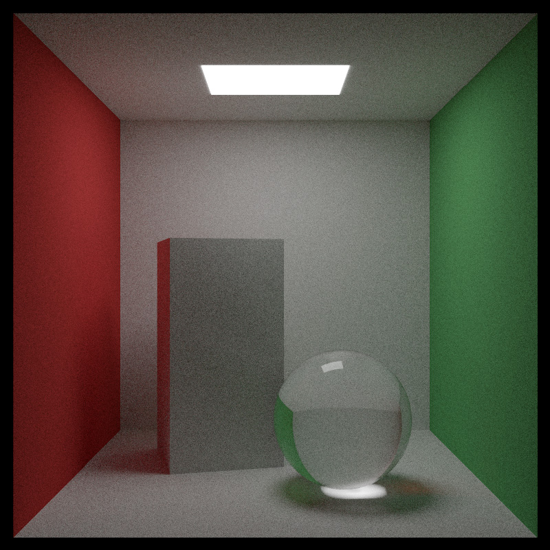
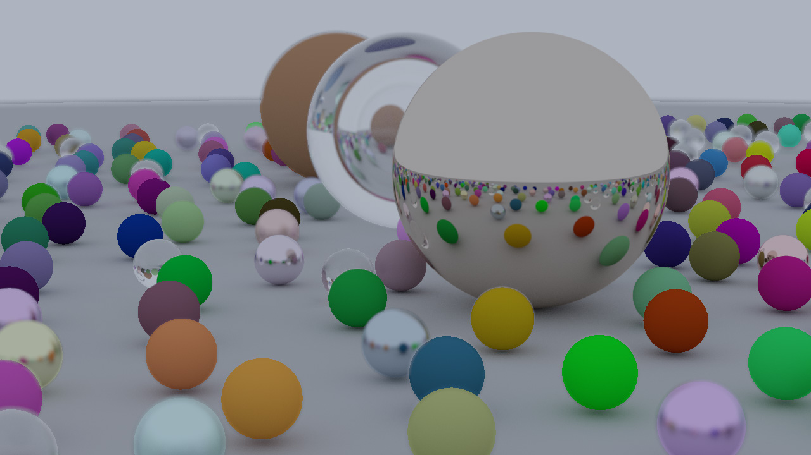
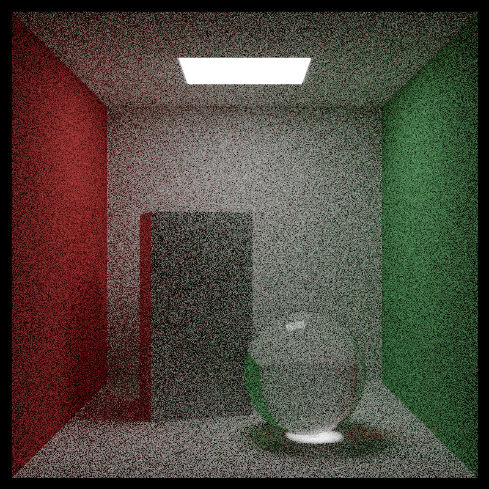
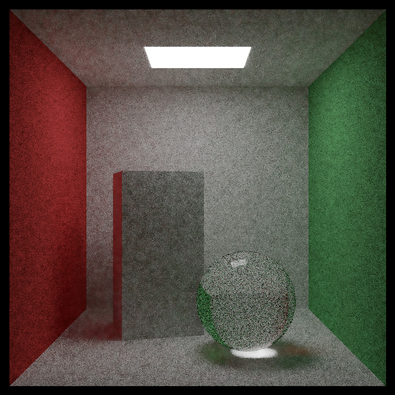
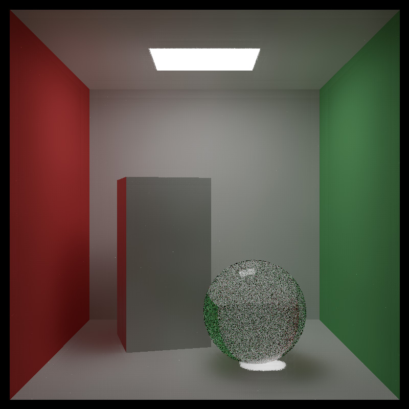
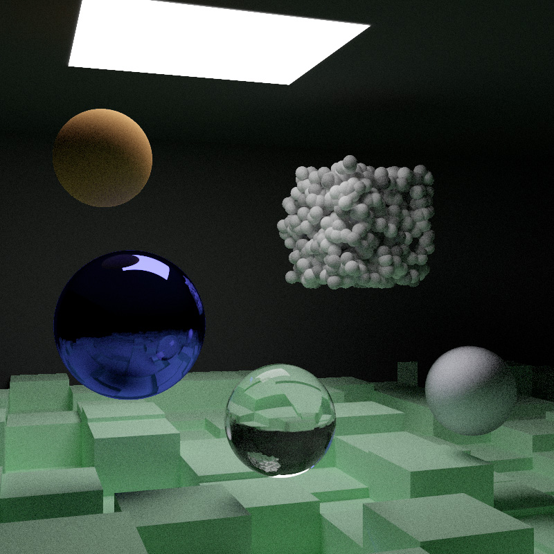

# Zig Path Tracer <!-- omit from toc -->




## Table of Contents
- [Table of Contents](#table-of-contents)
- [Introduction \& Motivation](#introduction--motivation)
- [Software Architecture](#software-architecture)
- [Technical Details](#technical-details)
- [Gallery \& Performance](#gallery--performance)
- [Getting Started](#getting-started)
  - [Prerequisites](#prerequisites)
  - [Clone the Repository](#clone-the-repository)
  - [Build \& Run](#build--run)
  - [Command Line Arguments](#command-line-arguments)

## Introduction & Motivation

This project is a CPU-based Monte Carlo path tracer written in the Zig programming language. It was developed with a dual focus: implementing a global illumination engine from scratch and exploring Zig's capabilities.

Building upon the foundational concepts from the *[Ray Tracing in One Weekend](https://raytracing.github.io/)* series, the codebase shifts away from C++ object-oriented patterns to leverage Zig's procedural design, explicit memory management, and data-oriented structures.

## Software Architecture

* **Application Configuration**: the executable handles CLI parsing, help output, scene and renderer selection, render settings, progress tracking, timing reports, and pipeline initialization.

* **Core Utilities and Mathematics**: shared utilities provide global configuration, numeric intervals, floating-point comparisons, quadratic-discriminant evaluation, range conversion, compile-time interface validation, and explicit allocator management. The mathematical layer provides vector operations, normalization, distance calculations, random geometric sampling, reflection, and refraction.

* **Camera, Rays, and Color**: the camera system supports perspective and look-at construction, viewport calculation, stratified anti-aliasing, and depth-of-field sampling. Rays provide parametric 3D traversal. The color system separates 8-bit RGB output colors from HDR linear colors used for light transport, with vectorized arithmetic, gradients, luminance, validation, and packed-pixel conversion.

* **Scene and Materials**: the scene owns the camera, background, geometry, materials, optional BVH, and scene lifecycle. Materials use tagged unions to implement Lambertian diffusion, metallic reflection, dielectric reflection and refraction, diffuse emission, attenuation, roughness, and scattering classification.

* **Geometry and Spatial Acceleration**: the geometry system implements spheres, quadrilaterals, boxes, hit records, polymorphic hittable dispatching, translation, and rotation around each axis. It also provides object-space transformations, axis-aligned bounding boxes, slab intersection tests, and closest-hit selection. BVHs accelerate traversal through longest-axis partitioning, geometry reordering, iterative node traversal, and narrowed ray intervals.

* **Rendering**: the path tracer recursively traces rays through the scene while separating diffuse, specular, and emissive contributions. Serial rendering processes scanlines sequentially, while parallel rendering distributes independent scanlines to a thread pool.

* **Frame Buffers and G-Buffers**: the rendering pipeline uses explicit buffers for diffuse, specular, emission, albedo, normal, depth, roughness, intermediate results, and final image data.

* **Post-Processing and Denoising**: the post-processing pipeline optionally applies joint bilateral or À-Trous denoising to diffuse and specular channels. Both filters use color and geometry buffers for edge preservation and support serial and parallel execution. The pipeline then recomposes the color information into an HDR image.

* **Display and Image Output**: display conversion supports clamp, Reinhard, extended Reinhard, exposure, and gamma tone mapping, followed by range limiting, sRGB correction, and 8-bit RGB conversion. The filesystem layer creates directories, prevents filename collisions, generates PPM P6 headers, memory-maps output files, and writes RGB data directly to the mapped image.

* **Testing and Resource Management**: embedded tests cover mathematics, vectors, colors, cameras, rays, geometry, BVHs, scenes, filesystem operations, image output, display transforms, and rendering support. Explicit ownership governs materials, transformed geometry, BVHs, buffers, files, memory maps, and concurrency resources, enabling deterministic cleanup across the complete pipeline.

## Technical Details
The engine is built around Data-Oriented Design principles and adheres to the *Zen of Zig*, prioritizing explicit control flow, lack of hidden allocations, and optimal memory layouts.

*   **Zero-Cost Polymorphism:** The rendering backend utilizes a Strategy Pattern implemented via tagged unions (`RenderBackend`). By leveraging Zig's `inline else` prongs in the `Renderer.render` orchestrator, dispatching is resolved entirely at compile-time.
*   **Data-Oriented Contexts & State Isolation:** The architecture decouples persistent configuration (`InternalRenderSettings`) from execution state. The execution infrastructure (such as thread pools via `std.Io` and progress tracking via `std.Progress.Node`) and memory buffers (`FrameBuffersRenderView`) are injected into the core algorithms as transient context structs (`RenderContext`, `DenoiserContext`). This isolation makes the renderers stateless and testable.
*   **Explicit Memory Management & Ownership Model:** The engine explicitly manages memory through `std.mem.Allocator`. The `Scene` struct acts as the sole owner of all dynamically allocated entities (like `Material` definitions on the heap), ensuring deterministic cleanup. Geometrical primitives hold non-owning `*const` pointers to these materials, preventing lifetime and double-free issues.
*   **Memory Safety & Views:** The post-processing pipeline exploits Zig's strict mutability rules. Denoisers receive G-Buffer data through a dedicated `GBuffersReadOnly` view, an approach that leverages compile-time type coercion (`[]T` to `[]const T`) to guarantee that complex spatial filters cannot accidentally corrupt G-Buffers during execution.
*   **Split Irradiance & Selective Denoising**: The path tracer inherently separates light transport into diffuse, specular and emission components (`SplitIrradiance` struct). This allows the engine to selectively bypass the spatial denoising passes (Joint Bilateral / A-Trous) for perfectly glossy materials (dielectrics and metals with `fuzz = 0.0`). Since primary G-Buffers represent the physical surface rather than the reflected virtual environment, filtering these pixels would incorrectly blur sharp reflections. Preserving mirror-like finishes while denoising requires more advanced techniques that are not covered in the current implementation.
*   **Comptime Metaprogramming:** Compile-time execution is used to eliminate runtime overhead. For instance, the file system utilities (`fs_utils.zig`) resolve maximum buffer capacities and precisely evaluate PPM header lengths during compilation (`computePpmP6HeaderSize`), bypassing dynamic heap allocations for string formatting in the I/O pipeline.
*   **Zero External Dependencies:** The project relies solely on the Zig standard library.

## Gallery & Performance

*Hardware Note: All benchmarks were executed on an i7-12700KF, compiled in `ReleaseFast` mode.*

### Procedural Spheres Scene <!-- omit from toc -->

- **Resolution**: 1280x720
- **Samples per Pixel**: 1000
- **Max Bounces**: 50
- **Denoising**: Off
- **Render Time (Parallel)**: 99s

### Cornell Box Scene <!-- omit from toc -->

- **Resolution**: 800x800
- **Samples per Pixel**: 1000
- **Max Bounces**: 50
- **Denoising**: Off
- **Render Time (Parallel)**: 112s

### Denoising Comparison (Low Sample Count) <!-- omit from toc -->

To demonstrate the efficiency of the post-processing pipeline, the following renders are generated at extremely low sample counts, where Monte Carlo noise is heavily present.

| 50 Samples (No Filter) | 50 Samples (Joint Bilateral) | 50 Samples (A-Trous) |
| :---: | :---: | :---: |
|  |  |  |
| **Render Time**: 5892ms | **Total Time**: 6481ms | **Total Time**: 6175ms |

### Final Scene <!-- omit from toc -->

- **Resolution**: 800x800
- **Samples per Pixel**: 1000
- **Max Bounces**: 50
- **Denoising**: Off
- **Render Time (Parallel)**: 855s

## Getting Started

### Prerequisites
Ensure you have [Zig](https://ziglang.org/download/) installed (built and tested on **Zig `0.16.0-dev`**).

### Clone the Repository
```bash
git clone https://github.com/giulio-arecco/zig-path-tracer.git
cd zig-path-tracer
```

### Build & Run

The project uses the standard Zig build system. By default, it optimizes for execution speed (`ReleaseFast`).

You can explicitly change the compilation mode by appending the `-Doptimize` flag. For example, to build with safety checks enabled (`ReleaseSafe`):

```bash
zig build -Doptimize=ReleaseSafe
```

To build and run directly while passing arguments to the executable:

```bash
zig build run --scene CornellBox --samples 100 --track-progress
```

*(Note: Renders are automatically saved to the `renders/` directory as `output.ppm` by default).*

### Command Line Arguments

Whenever an argument expects a value, it can be provided either with the syntax `--<argument>=<value>` or `--<argument> <value>`.

| Argument | Description | Default | Available Values |
| --- | --- | --- | --- |
| `--help` | Print the help message and exit. | N/A | N/A |
| `--renderer` | Choose the rendering algorithm. | `Parallel` (if supported), else `Serial` | `Serial`, `Parallel` |
| `--scene` | Choose the scene to render. | `CornellBox` | `ProceduralSpheres`, `CornellBox`, `Quads`, `Final` |
| `--img-height` | Choose the output image height. | `600` | 0 to 65535 |
| `--img-width` | Choose the output image width. | `600` | 0 to 65535 |
| `--max-bounces` | Choose the max number of ray bounces. | `50` | 0 to 65535 |
| `--samples` | Choose how many times each pixel is sampled. | `200` | 0 to 65535 |
| `--denoiser` | Choose a post-processing denoiser. | `None` | `None`, `JointBilateral`, `ATrous` |
| `--track-progress` | Track the rendering progress. *(Toggle flag)* | `false` | N/A |
| `--time-report` | Log the total rendering time. *(Toggle flag)* | `false` | N/A |
